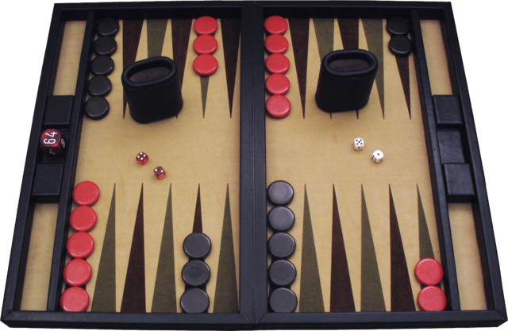

<h1 align="center">TD-Gammon</h1> <br>
<p align="center">
   
</p>

---
# Table of Contents
- [Features](#features)
- [Installation](#installation)
- [How to interact with GNU Backgammon using Python Script?](#howto)
- [Backgammon OpenAI Gym Environment](#env)
- [Bibliography, sources of inspiration, related works](#biblio)
- [License](#license)
---
## <a name="features"></a>Features
- PyTorch implementation of TD-Gammon [1].
- Test the trained agents against an open source implementation of the Backgammon game, [GNU Backgammon](https://www.gnu.org/software/gnubg/).
- Play against a trained agent via web gui

---
## <a name="installation"></a>Installation

I used [`Anaconda3`](https://www.anaconda.com/distribution/), with `Python 3.6.8` (I tested only with the following configurations). 

Create the conda environment: 
```
$ conda create --name tdgammon python=3.6
$ source activate tdgammon
(tdgammon) $ git clone https://github.com/dellalibera/td-gammon.git
```
Install the environment [`gym-backgammon`](#https://github.com/dellalibera/gym-backgammon):
```
(tdgammon) $ git clone https://github.com/dellalibera/gym-backgammon.git
(tdgammon) $ cd gym-backgammon
(tdgammon) $ pip install -e .
```

Install the dependencies [`pytorch v1.2`](https://pytorch.org/get-started/locally/):
```
(tdgammon) $ pip install torch torchvision
(tdgammon) $ pip install tb-nightly
```
or
```
(tdgammon) $ cd td-gammon/
(tdgammon) $ pip install -r requirements.txt
```

### GNU Backgammon
To play against `gnubg`, you have to install [`gnubg`](https://www.gnu.org/software/gnubg/).  
**NOTE**: I installed `gnubg` on `Ubuntu 18.04` (running on a Virtual Machine), with `Python 2.7` (see next section to see how to interact with GNU Backgammon).  
#### On Ubuntu:
```
sudo apt-get install gnubg
```
---
## <a name="howto"></a>How to interact with GNU Backgammon using Python Script?
I used an `http server` that runs on the Guest machine (Ubuntu), to receive commands and interact with the `gnubg` program.  
In this way, it's possible to send commands from the Host machine (in my case `MacOS`).  
<br>
The file `bridge.py` should be executed on the Guest Machine (the machine where `gnubg` is installed).
#### On Ubuntu:
```
gnubg -t -p /path/to/bridge.py
```
It runs the `gnubg` with the command-line instead of using the graphical interface (`-t`) and evaluates a Python code file and exits (`-p`).  
For a list of parameters of `gnubg`, run `gnubg --help`.   
<br>
The python script `bridge.py` creates an `http server`, running on `localhost:8001`.  
If you want to modify the host and the port, change the following line in `bridge.py`:
```python
if __name__ == "__main__":
    HOST = 'localhost' # <-- YOUR HOST HERE
    PORT = 8001  # <-- YOUR PORT HERE
    run(host=HOST, port=PORT)
```
The file `td_gammon/gnubg/gnubg_backgammon.py` sends messages/commands to `gnubg` and parses the response.

---
## <a name="env"></a>Backgammon OpenAI Gym Environment
For a detailed description of the environment: [`gym-backgammon`](https://github.com/dellalibera/gym-backgammon).

---
## <a name="biblio"></a>Bibliography, sources of inspiration, related works
- TD-Gammon and Temporal Difference Learning:
    - [1] [Practical Issues in Temporal Difference Learning](https://papers.nips.cc/paper/465-practical-issues-in-temporal-difference-learning.pdf)
    - [Temporal Difference Learning and TD-Gammon](https://researcher.watson.ibm.com/researcher/view_page.php?id=7021)
    - [Programming backgammon using self-teaching neural nets](www.bkgm.com/articles/tesauro/ProgrammingBackgammon.pdf)
    - [Implementaion Details TD-Gammon](http://www.scholarpedia.org/article/User:Gerald_Tesauro/Proposed/Td-gammon)
    - [Chapter 9 Temporal-Difference Learning](https://web.stanford.edu/group/pdplab/pdphandbook/handbookch10.html)
    - [Implementation Details of the TD(λ) Procedure for the Case of Vector Predictions and Backpropagation](https://www.ece.uvic.ca/~bctill/papers/learning/Sutton_1987.pdf)
    - [Learning to Predict by the Methods of Temporal Differences](http://incompleteideas.net/papers/sutton-88-with-erratum.pdf) 
<br><br>
- GNU Backgammon: https://www.gnu.org/software/gnubg/ 
<br><br>
- Rules of Backgammon:
    - www.bkgm.com/rules.html
    - https://en.wikipedia.org/wiki/Backgammon
    - <a name="starting_position"></a>Starting Position: http://www.bkgm.com/gloss/lookup.cgi?starting+position
    - https://bkgm.com/faq/
<br><br>    
- Install GNU Backgammon on Ubuntu:
    - https://ubuntuforums.org/showthread.php?t=2217668
    - https://ubuntuforums.org/showthread.php?t=1506341
    - https://www.reddit.com/r/backgammon/comments/5gpkov/installing_gnu_or_xg_on_linux/
<br><br>
- How to use python to interact with `gnubg`: [\[Bug-gnubg\] Documentation: Looking for documentation on python scripting](https://www.mail-archive.com/bug-gnubg@gnu.org/msg06794.html)
<br><br>
- Other Implementation of the Backgammon OpenAI Gym Environment: 
    - https://github.com/edusta/gym-backgammon
<br><br>
- Other Implementation of TD-Gammon:
    - https://github.com/TobiasVogt/TD-Gammon
    - https://github.com/millerm/TD-Gammon
    - https://github.com/fomorians/td-gammon
<br><br>
- How to setup your VMWare Fusion images to use static IP addresses on Mac OS X
    - https://gist.github.com/pjkelly/1068716/6d19faa0122c0e1efe350e818bb8f4e8687ea1ab
<br><br>
- PyTorch Tensorboard: https://pytorch.org/docs/stable/tensorboard.html

---
## <a name="license"></a>License
[MIT](https://github.com/dellalibera/td-gammon/blob/master/LICENSE) 